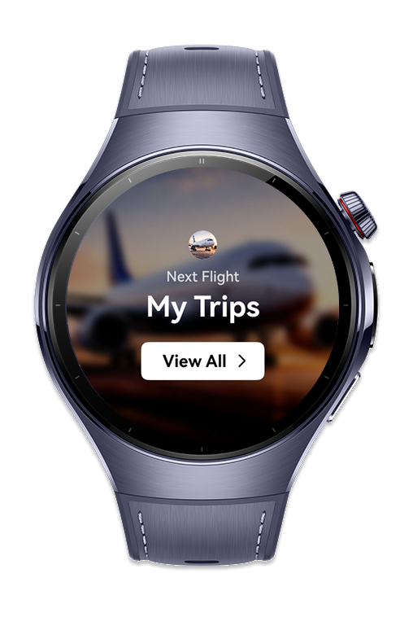
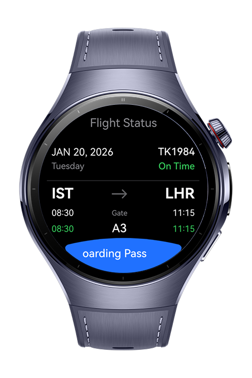
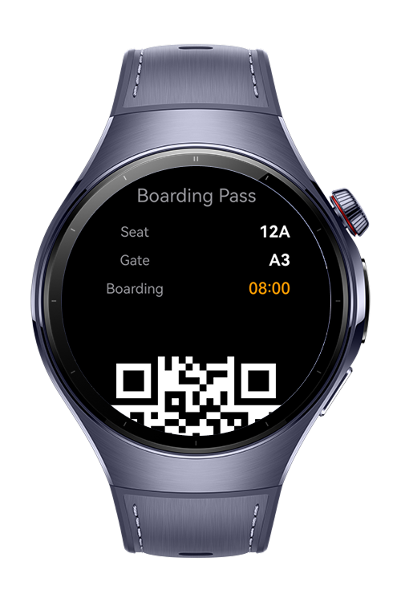

> **Note:** To access all shared projects, get information about environment setup, and view other guides, please visit [Explore-In-HMOS-Wearable Index](https://github.com/Explore-In-HMOS-Wearable/hmos-index).

# Airlines Smart Wearable

**Airlines Smart Wearable** is a smartwatch application designed to help users quickly and effortlessly track their flight information. The app presents the entire flight journey in a simple and intuitive flow, allowing users to access critical details with minimal interaction.

On the main screen, users can tap the “View All” button to navigate to the Flight Status page, where all their flights are displayed in a list format with summary information.

By selecting a flight from the list, the user is taken to the Flight Details screen. This screen provides detailed information such as:

- Departure and destination

- Takeoff and landing times

- Flight number and date details

Below the flight details, the “View Boarding Pass” button allows the user to access their digital boarding pass. This screen displays:

- Gate

- Seat

- Boarding time

- A dynamically generated QR code

The QR code is ready to be used for fast access and verification at the airport.

With its clean interface and smartwatch-optimized design, Flight Status Watch App enables users to stay informed about their flights at a glance, even while on the move.

# Preview

<p align="left">
    
    
    
    
</p>

# Use Cases

1. The user opens the Flight Status Watch App on their smartwatch.

2. Taps the “View All” button on the main screen.

3. Views all available flights on the Flight Status page.

4. Selects a specific flight to open the flight details screen.

5. Reviews departure, destination, and timing information.

6. Taps the “View Boarding Pass” button.

7. Views the gate, seat, boarding time, and QR code.

8. Uses the smartwatch to complete the boarding process smoothly.

# Technology

## Stack

**Languages**: ArkTS, ArkUI  
**Frameworks**: HarmonyOS SDK 6.0.0  
**Tools**: DevEco Studio 6.0.0  
**Libraries/Kits**:

- @kit.BasicServicesKit
- @kit.AbilityKit
- @kit.ArkUI
- @kit.CoreFileKit
- @kit.WearEngine

# Directory Structure

```
│   module.json5
│
├───ets
│   ├───components
│   │       FlightCard.ets
│   │       QrPlaceholder.ets
│   │       StatusChip.ets
│   │
│   ├───entryability
│   │       EntryAbility.ets
│   │
│   ├───entrybackupability
│   │       EntryBackupAbility.ets
│   │
│   ├───mock
│   │       MockData.ets
│   │       Types.ets
│   │
│   ├───pages
│   │       BoardingPass.ets
│   │       FlightDetail.ets
│   │       FlightStatus.ets
│   │       Index.ets
│   │
│   ├───services
│   │       WearEngineService.ets
│   │
│   ├───theme
│   │       Theme.ets
│   │
│   └───utils
│           DateHelper.ets
│
└───resources
    ├───base
    │   ├───element
    │   │       color.json
    │   │       float.json
    │   │       string.json
    │   │
    │   ├───media
    │   │       background.png
    │   │       boarding_pass.png
    │   │       fl_status.png
    │   │       foreground.png
    │   │       layered_image.json
    │   │       startIcon.png
    │   │
    │   └───profile
    │           backup_config.json
    │           main_pages.json
    │           router_map.json
    │
    └───dark
        └───element
                color.json

```

# Constraints and Restrictions

## Supported Device

- Huawei Watch 5

# License

**Airlines Smart Wearable** is distributed under the terms of the **MIT License**
See the [LICENSE](LICENSE) for more information.